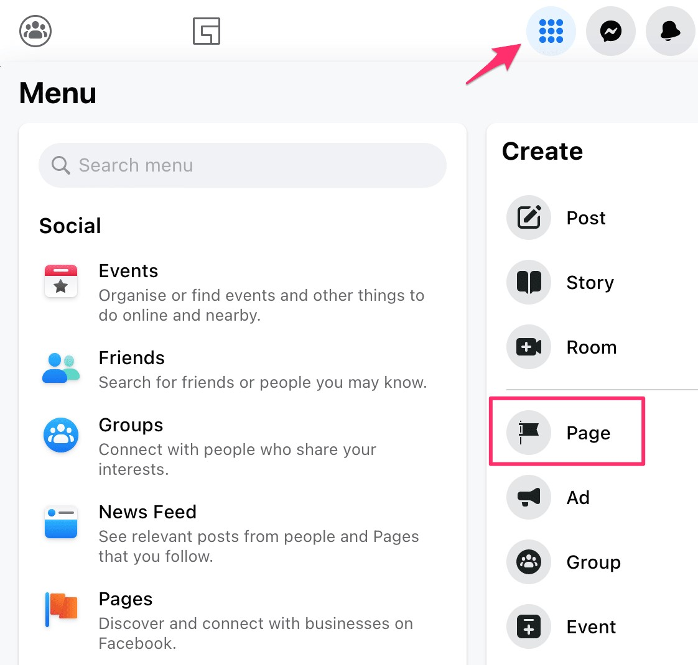
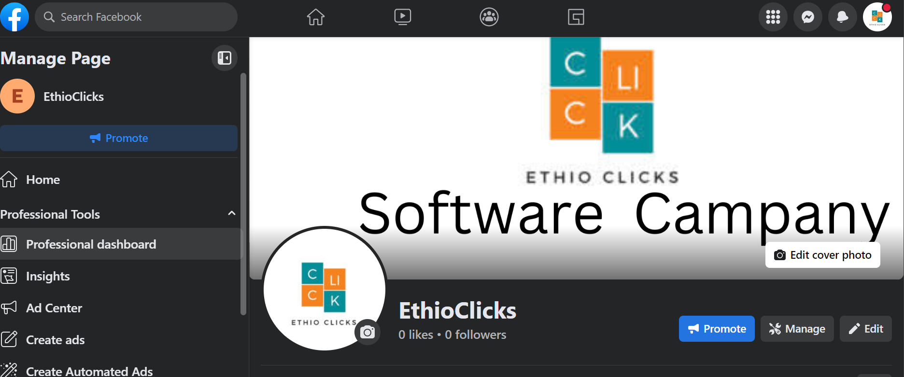
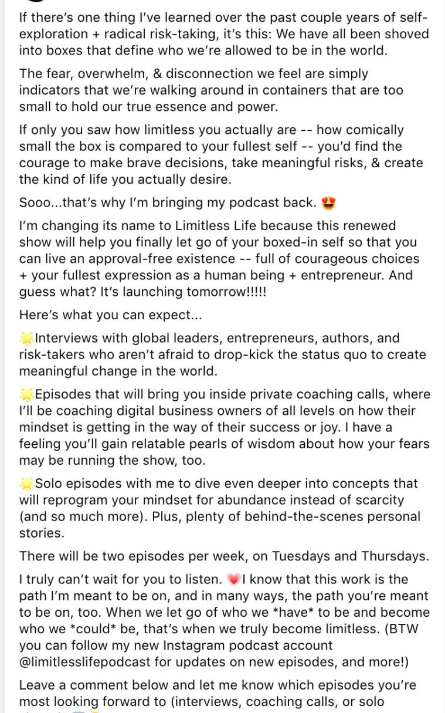

#                                    **Facebook Marketing**

# **Introduction** 

Facebook is a social networking site that allows you to connect and share with family and friends online. Originally designed for college students, Facebook was created in 2004 by Mark Zuckerberg while he was enrolled at Harvard University.Today, Facebook is the world's largest social network, with billions of users worldwide. Facebook is not only social media it is also a large company that includes many other social media like instagram,what’s up, messenger and so on.

Facebook has around 2.7 billion active users. Facebook is so big that honestly, no matter what country you're in, what industry and niche you operate in, your potential customers and your audience is going to be on Facebook. This makes facebook a great opportunity to advertise your product and services for billions of active users.

# **What Is Facebook Marketing**

 **Facebook marketing** is the practice of promoting your product, services and brand through Facebook. It can help businesses build brand awareness, grow an online following, and sell more products or services. Facebook is by far the most popular social media network. So by default, it is  likely that your audiences and your potential customers are going to be on the platform.

Facebook marketing can be done  completely for free, or optionally, you can accelerate your growth with paid services, like Facebook ads, boosted content, or influencer/partnership campaigns.

# **How To create FaceBook Page**

Having a page on Facebook gives you the opportunity to generate tons of potential customers for your business. As on your page, you have an option to actually link to your website, you have your phone number and so on and so on.

To create a facebook page, you do actually need to have an account with Facebook. So if you don't already have an account with Facebook, simply head over to facebook.com create account.

1. Sign in to [Facebook](https://www.facebook.com/) with your personal account. Your personal information won’t show on your Page, but you can also create a new Facebook account with a work email address if you prefer.
2. Open the menu (the nine dots on the right side) and click Create, then Page.

3. create your Page, by filling the following information 
   1. **Name**: Your business name
   1. **Category**: Start typing to see the available options. For example, “Technology” .
   1. **Description**: A sentence or two describing what your business does. You can edit this later.
4. Then after creat now your page has become live. E,g 

# **How To Design A Facebook Cover Image:**

A Facebook page cover has significant visual real estate on your business or personal page. Making optimal use of it can help promote your brand and create a unique identity.

There are many tools to create amazing facebook cover images like photo Director, paintShop,picmonkey, and Canva. Let’s try to create our cover image using **canva.**

**Open Canva**

   Open Canva and search for "Facebook Covers" to get started.

**Explore templates**

 Find Facebook cover templates for every theme, color, mood and style that best fit what you’re looking for. Whether you’re sprucing up your personal profile or hosting an event, you’ll find an option for every occasion.

**Personalize your cover**

 Make your Facebook cover as unique as you are. Upload your own photos, videos, images, branding elements and more. Choose your own color scheme, layout and font style.

**Upload to your page**

   Once you’re done finalizing your cover design, you can download and save it as a PNG, JPG or GIF. Upload it to your Facebook profile or page.
   

   E.g  after updating my facebook page.

# **How to create a Facebook marketing strategy**

1. **Define your audience**
   1. Before you do anything, you must first define who your ideal potential customer is and what they want on Facebook. Then, create a marketing and content strategy around that.
   1. What  age range do they fall in?
   1. Where do they live?
   1. What types of jobs or job responsibilities do they have?
   1. What problem do they have with [your industry/product]? (And how are you the solution?)
   1. How and when do they use Facebook?
2. **Define your goals**
   1. Why do you want followers? What do you want them to do? For most companies, the answer is, “Buy something.” But it’s not always about money. Other common goals for a Facebook Page are to:
      1. Build brand awareness
      1. Improve customer service
      1. Maintain a consistent brand image across social media
      1. Bring in traffic to a physical location
3. **Plan your content strategy**
   1. What you’ll post
   1. When you’ll post it
4. **Optimize your Page**
   1. Whether you’ve just set up your Facebook business Page or had one for awhile, make sure you have:
      1. A profile photo of your logo works great and a cover photo.
      1. A call to action button, such as Book Now.
      1. Contact information, including URL, phone number, and an email address.
      1. A detailed section.
      1. A pinned post with your latest promotion, offer, or FAQ.

# **What Should Post To Increase Your Page**

The decision to post on FacebookPage should depend on your business’s individual marketing goals.When your audience discovers you are  on the platform, you can work to develop a community of like-minded consumers and deepen the connection they have to your brand. When you engage with them, you’ll learn more about their likes and interests, making it easier for you to create content they’ll enjoy and interact with.

#  **Some  posts that increase your pages audience**

  - **Posting  Trending Topics** One great way to increase reach and engagement is to post about trending topics people are talking about. Not only can this increase your chances of appearing in feeds, but people will be more likely to comment on and share your posts as well.
  - **Tell Stories** Get personal with your audience. Telling stories is a great way to connect with your Facebook followers on a different level. And your story will depend on how small your business is.
  

**Video**  Facebook loves when users post videos, and they even have an entire “Watch” section dedicated to video alone.This is why videos are great Facebook post ideas to improve your strategy. Create and share them often, whether they’re basic stop motion videos, informational videos, educational videos or another type altogether.

# **What Is The Difference Between Like and Follow**

When running a Facebook business page, it’s important to understand the terminology of like and follow. This gives you a deeper comprehension of who is seeing and interacting with your content. When you come across a Facebook Page that sparks your interest, you will be faced with an important decision to like or follow.

**Like** When an individual likes your page on Facebook, they automatically opt into following your page. This means that your posts will be seen in their feed and you will be listed in their ‘liked’ directory. It’s important to know that users can unfollow your page after liking your page, which means won’t see your content very often.

**Follow** Facebook users have the option to follow a page without hitting the like button. These types of followers will still see your posts in their newsfeed, but they won’t be considered a like on your page. This option was set up for people who didn’t want to befriend someone on Facebook but still wanted to see their posts.

# **Facebook Insight**

Facebook Insights is an analytics dashboard where you can track user behavior and post performance on your Facebook business page. In addition to providing key metrics like page views and post reach for paid and organic posts, the platform also recommends competitor pages to watch and track. Facebook Insights visualizes incoming data from your business page so you can learn how users are behaving on your page, what content they are engaging with, and how your page matches up to competitors.

**Your Facebook Insights dashboard** displays top metrics about your business page. On any given day, you can get a snapshot of your page's performance and adjust your strategy accordingly. Top metrics include:

- **Page views** – The number of times your page has been viewed by Facebook and non-Facebook users
- **Actions on page** – How many actions users take on your business page, such as to click on a website link or ask for directions to your store.
- **Post reach** – The number of users on Facebook who saw your post.
- **Post engagement** – How many people liked, shared, reacted, or commented on your post.

